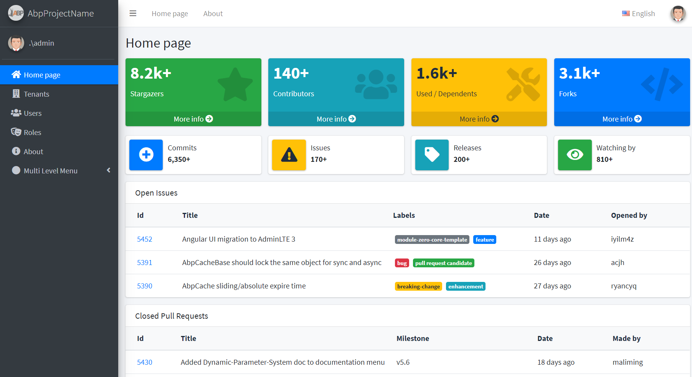
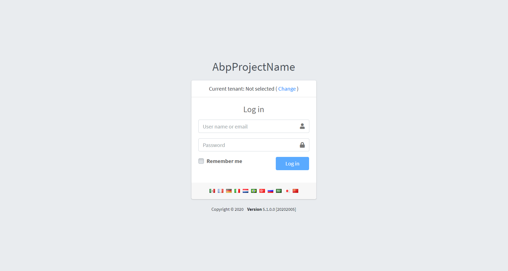
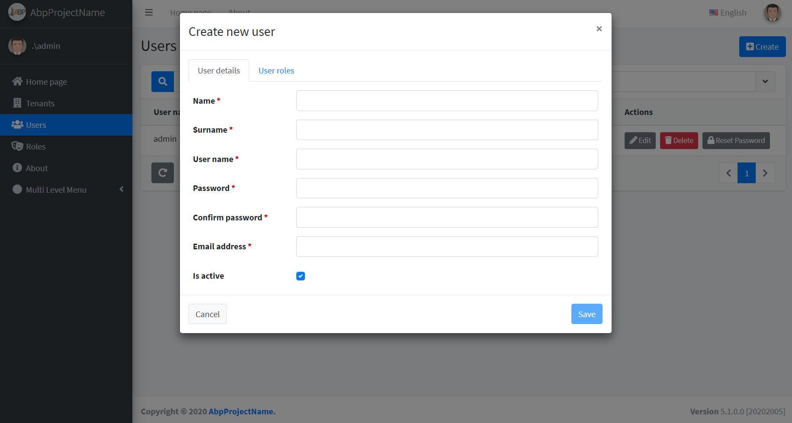

# C10-BoilerPlate

A customized ASP.NET Boilerplate template featuring ASP.NET Core backend and Angular frontend for rapid application development.

## Introduction

C10-BoilerPlate is a full-stack web application template built on the ASP.NET Boilerplate framework. It provides a solid foundation for building scalable, multi-tenant web applications with a modern architecture.

## Features

- **Backend**: ASP.NET Core with modular architecture (Application, Core, Domain, EntityFrameworkCore)
- **Frontend**: Angular 19 with PrimeNG UI components
- **Multi-tenancy**: Built-in support for multi-tenant applications
- **Authentication & Authorization**: Integrated user management and role-based access control
- **Database**: Entity Framework Core with migration support
- **Real-time Communication**: SignalR integration
- **UI Theme**: AdminLTE theme with responsive design
- **Localization**: Multi-language support (English, Vietnamese)
- **Docker Support**: Containerized deployment options

## Prerequisites

- .NET 9.0 or later
- Node.js 18+ and npm
- SQL Server (or other supported database)
- Visual Studio 2022 or VS Code

## Installation

1. Clone the repository:
   ```bash
   git clone <repository-url>
   cd C10-BoilerPlate
   ```

2. Backend Setup:
   - Navigate to `aspnet-core` directory
   - Restore NuGet packages: `dotnet restore`
   - Update database connection string in `appsettings.json`
   - Run migrations: `dotnet ef database update`

3. Frontend Setup:
   - Navigate to `angular` directory
   - Install dependencies: `npm install`
   - Generate service proxies: `npm run nswag`

## Running the Application

### Development Mode

1. Start the backend:
   ```bash
   cd aspnet-core/src/C10.Web.Host
   dotnet run
   ```

2. Start the frontend:
   ```bash
   cd angular
   npm start
   ```

3. Open your browser and navigate to `http://localhost:4200`

### Using Docker

1. Navigate to `aspnet-core/docker/ng`
2. Run `up.ps1` (Windows) or `up.sh` (Linux/Mac)

## Project Structure

```
C10-BoilerPlate/
├── aspnet-core/          # ASP.NET Core backend
│   ├── src/
│   │   ├── C10.Application/    # Application services
│   │   ├── C10.Core/           # Core business logic
│   │   ├── C10.Domain/         # Domain entities
│   │   ├── C10.EntityFrameworkCore/  # Data access layer
│   │   ├── C10.Web.Core/       # Web core functionality
│   │   └── C10.Web.Host/       # Web host application
│   ├── test/                   # Unit tests
│   └── docker/                 # Docker configurations
├── angular/              # Angular frontend
│   ├── src/
│   │   ├── app/                # Angular application
│   │   ├── assets/             # Static assets
│   │   └── shared/             # Shared components and services
│   ├── nswag/                  # API client generation
│   └── scripts/                # Build scripts
├── _screenshots/         # UI screenshots
└── README.md             # This file
```

## Technologies Used

- **Backend**: ASP.NET Core, Entity Framework Core, SignalR
- **Frontend**: Angular 19, PrimeNG, RxJS
- **Database**: SQL Server
- **UI**: AdminLTE, FontAwesome
- **Build Tools**: Angular CLI, NSwag
- **Testing**: Jasmine, Karma

## Contributing

1. Fork the repository
2. Create a feature branch: `git checkout -b feature/your-feature`
3. Commit your changes: `git commit -am 'Add some feature'`
4. Push to the branch: `git push origin feature/your-feature`
5. Submit a pull request

## License

This project is licensed under the MIT License - see the [LICENSE](LICENSE) file for details.

## Screenshots

### Home Dashboard


### Login Page


### User Management

